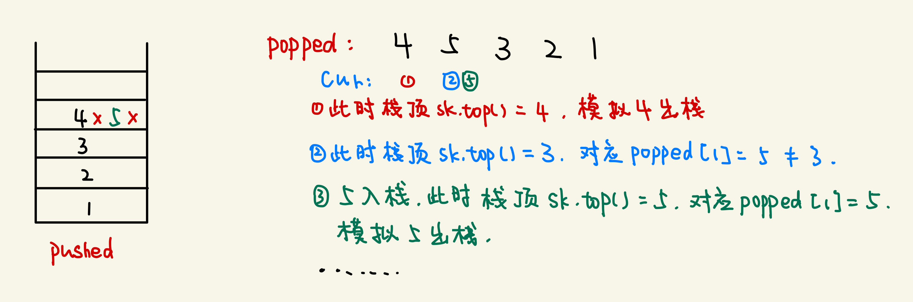

#### 题意

给定栈的压栈序列，看第二个序列是否为栈的弹出序列

#### 思路

- 也是模拟题，我们维护一个栈，手动模拟入栈过程，并且在「可能出栈的时候尽可能出栈」，也就是说在入栈的时候如果刚好发现入栈的元素等于对应要出栈的元素，我们就出栈，最后检查是否已经模拟出了栈的弹出序列
- 以题目的例子来说，就是要`pushed = [1,2,3,4,5], popped = [4,5,3,2,1]`，设置一个指针指向`popped[0] = 4`，在模拟入栈`4`的时候，出栈序列的第一个也是`4`，我们就将指针指向`popped[1] = 5`，循环检查「栈顶元素」和「出栈序列的对应元素」



#### 代码

```c++
class Solution {
public:
    bool validateStackSequences(vector<int>& pushed, vector<int>& popped) {
        vector<int> sk;
        int cur = 0;
        for(auto e: pushed) {
            sk.emplace_back(e);
            while(!sk.empty() && sk.back() == popped[cur]) {
                cur++;
                sk.pop_back();
            }
        }
        if(cur == popped.size()) {
            return true;
        }else {
            return false;
        }
        return false;
    }
};
```

